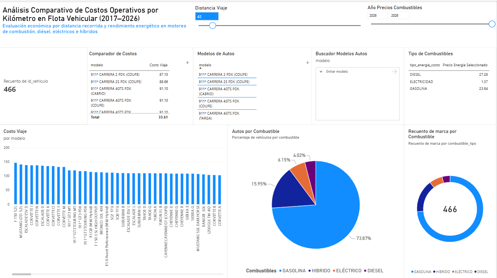

# Análisis Operativo y Costos de Flota Vehicular en México

Modelo analítico desarrollado en **Power BI y Google BigQuery** para evaluar, simular y analizar el costo operativo y las emisiones de una flota vehicular mixta (Gasolina, Diésel, Híbrido y Eléctrico), utilizando datos históricos de vehículos y precios de energéticos correspondientes al periodo 2017–2026.

## 📊 Vista Previa del Tablero

## 🚀 Características Principales

* **Simulador Dinámico de Distancias:** Permite calcular el gasto operativo estimado según los kilómetros que el usuario decida consultar de forma interactiva.
* **Modelado en Estrella:** Separación entre el catálogo de vehículos y las series históricas de precios de energéticos para facilitar el análisis en Power BI.
* **Lógica para Vehículos Híbridos:** Tratamiento específico mediante medidas y lógica de cálculo en Power BI para estimar el costo operativo de vehículos híbridos.
* **Análisis de Emisiones:** Comparación de emisiones de CO₂ entre vehículos y tipos de combustible.
* **Análisis SQL:** Consultas realizadas en Google BigQuery para analizar rendimiento, costos y emisiones vehiculares.

## 🧮 Análisis SQL

Se utilizaron consultas SQL en **Google BigQuery** como complemento al modelo desarrollado en Power BI.

Las consultas incluyen:

* Rendimiento promedio por tipo de combustible.
* Costo estimado para recorrer 35 km utilizando precios de combustible de 2026.
* Top 10 de vehículos con mayores emisiones.
* Emisiones promedio por tipo de combustible.

📄 **[Ver consultas SQL](analisis_vehicular.sql)**

## 📝 Notas Metodológicas y Fuentes de Datos

* **Tratamiento de Datos:** Los precios de los energéticos se procesaron a partir de registros históricos, utilizando agregaciones anuales y mensuales según la disponibilidad de cada fuente.
* **Clasificación de vehículos:** Los tipos de combustible y los valores de rendimiento fueron tomados de las fuentes de datos utilizadas, sin reasignar manualmente la clasificación de los vehículos.
* **Precios utilizados:** Para el análisis de costos actuales se utilizaron los precios correspondientes a 2026. Las series históricas se conservaron para permitir análisis temporal.
* **Fuentes de Información y Fabricantes:** Para complementar las especificaciones técnicas, rendimientos y costos de los vehículos y energéticos se consultaron bases de datos oficiales y catálogos de marcas:

  * [CONUEE - Rendimiento de combustible en vehículos ligeros](https://www.gob.mx/conuee/documentos/rendimiento-de-combustible-en-vehiculos-ligeros-de-venta-en-mexico)
  * [Comisión Nacional de Energía (CNE) - Datos Abiertos](https://www.gob.mx/cne/articulos/consulta-de-datos-abiertos)
  * [CFE (Comisión Federal de Electricidad)](https://www.cfe.gob.mx/Pages/default.aspx)
  * Portales de fabricantes y distribuidores de vehículos en México: [BYD México](https://www.byd.com/mx), [Changan México](https://www.changan.mx/), [Geely México](https://www.geelymexico.com/), [Chevrolet México](https://www.chevrolet.com.mx/), [GMC México](https://www.gmc.com.mx/) y [Avatr](https://www.avatr.com/en).
